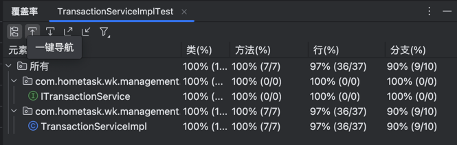
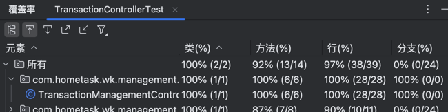

# Bank-Transaction-Management

用于 HSBC Home Task。

## 系统简介

目的：创建一个简单的银行系统交易管理应用程序。该应用程序应允许用户记录、查看和管理财务交易。

在线演示访问地址（阿里云服务器2c2g配置，docker部署）：

访问路径 : http://39.104.22.4/index.html

## 设计方案

### 架构

* 接口形式：遵循RESTful API设计原则
* 代码分层结构：从controller层，业务逻辑服务层，数据库数据层，已实现不错的扩展性和可维护性

### 技术

* java21、SpringBoot框架、maven构建、h2数据库、Docker容器化、html+js前端页面

### 数据相关设计

数据库使用H2数据库，在内存模式下运行

#### **数据实体Transaction.java**

* id：唯一ID，交易管理系统ID
* code：用户或使用方唯一码，防止重复提交
* type：交易类型 支持该字段修改和筛选分页查询
* fromAccountId：转账账户ID
* toAccountId：到账账号账户ID
* amount：金额，实际需要考虑精度，如用BigDecimal（注意：这里类型应为BigDecimal而非String以避免精度问题）
* description：交易备注
* createdTime：添加交易记录的时间 更新操作不修改
* updateTime：更新时间

具体见 com.hometask.wk.management.entity.Transaction

### API设计

遵循RESTful API设计原则

#### 交易管理API接口说明

**基础路径**：`/api/transaction`

**1. 分页查询交易记录**

- **请求方式**：GET
- **请求路径**：`/api/transaction`
- **请求参数**：
    - `type`（可选）：交易类型，用于筛选特定类型的交易记录。
    - `page`（可选，默认值为0）：当前页码，用于分页显示交易记录。
    - `size`（可选，默认值为10）：每页显示的交易记录数量。
- **响应内容**：返回包含交易记录分页信息的`ApiResponse`对象。

**2. 根据ID查看交易记录**

- **请求方式**：GET
- **请求路径**：`/api/transaction/{id}`
- **路径参数**：
    - `id`：需要查看的交易记录的ID。
- **响应内容**：返回指定ID的交易记录的`ApiResponse`对象。

**3. 创建交易记录**

- **请求方式**：POST
- **请求路径**：`/api/transaction`
- **请求参数**：
    - `code`（必填）：用户或使用方的唯一码，用于防止重复提交。
    - `type`（可选）：交易类型，长度需在2到20个字符之间。
    - `fromAccountId`（可选）：转账账户ID。
    - `toAccountId`（可选）：到账账户ID。
    - `amount`（可选）：交易金额，需大于0.01。注意：尽管此处为字符串类型，但建议后台处理时转换为数值类型以确保精度。
    - `description`（必填）：交易备注，长度需在2到20个字符之间。
- **响应内容**：返回创建成功的交易记录的`ApiResponse`对象，或在发生业务异常时返回错误信息。

**4. 修改交易记录**

- **请求方式**：PUT
- **请求路径**：`/api/transaction/{id}`
- **路径参数**：
    - `id`：需要修改的交易记录的ID。
- **请求参数**：
    - `type`（可选）：交易类型，长度需在2到20个字符之间。
    - `fromAccountId`（可选）：转账账户ID。
    - `toAccountId`（可选）：到账账户ID。
    - `amount`（可选）：交易金额，需大于0.01。
    - `description`（必填）：交易备注，长度需在2到50个字符之间。
- **响应内容**：返回修改成功的交易记录的`ApiResponse`对象，或在发生业务异常时返回错误信息。
  **注意**：`createdTime`字段在修改时不应被更新，此处在代码中设置可能是一个错误。

**5. 删除交易记录**

- **请求方式**：DELETE
- **请求路径**：`/api/transaction/{id}`
- **路径参数**：
    - `id`：需要删除的交易记录的ID。
- **响应内容**：在删除成功时返回成功的`ApiResponse`对象，或在发生业务异常时返回错误信息。

---

**注意**：

- 在实际开发中，`amount`字段应使用数值类型（如`BigDecimal`）以确保精度，而非字符串类型。
- 在修改交易记录时，通常不应更新`createdTime`字段，因为该字段记录了交易记录的创建时间。在提供的代码中，`createdTime`
  被错误地设置为当前时间，这在实际应用中可能并不合适。

#### 参数校验

    引用spring-boot-starter-validation进行参数校验，并统一将参数校验异常输出通用错误信息返回。
    时间关系只实现了小部分参数简单校验

#### 异常处理

    自定义业务异常BizException，自定义异常信息、标准化错误返回形式，方便前端标准处理。
    为创建重复交易或删除不存在的交易等场景实现错误处理

### 缓存机制

#### SpringCache+Caffeine

* 引用SpringCache 使用 `@Cacheable`, `@CachePut`, `@CacheEvict` 和 `@Caching` 注解快速完成缓存逻辑。
* 使用 Caffeine 作为本地缓存，Caffeine默认配置策略，提供单数据实体、批量存储分页两种CacheManager 并分别支持两个过期时间30分钟和2小时
* 利用注解实现了数据变动及时清缓存和刷新缓存的基本逻辑，尽量避免系统访问脏数据
* 当前场景下，内存数据库H2+本地内存缓存Caffeine起到冗余存储，基本是用空间换时间的效果

#### BloomFilter

* 由于数据未持久化，重启系统不需要初始化数据，很适合用布隆过滤器提示系统性能
* 引用guava中布隆过滤器，对交易实体单数据查询做请求过滤，理论上可以提升应对大量空查询的能力

## 全面测试

### 测试覆盖率：

    * 引用JUnit和Mockito进行单元测试
    * 单元测试具体见单测代码，做到方法覆盖率100%和成功率100%

* 对service层方法覆盖率：100%
  

* controller层接口覆盖率：100%

  

### 压力测试

## 总结

- 本项目中实现了简单的银行系统交易管理应用程序的基本功能。
- 实现了核心操作功能：查询（支持分页+交易类型筛选），创建，更新，删除。
- 系统经过全面测试，包括单元测试和压力测试。
- RESTful API设计+分层代码结构设计，对外接口规范清晰，对内系统具备不错的可扩展和可维护性。
- 核心操作通过缓存保证性能和尽可能避免赃读。
- 提供了校验和异常处理能力，并方便后续的升级完善。
- 通过Docker进行容器化部署，支持线上IP访问。
